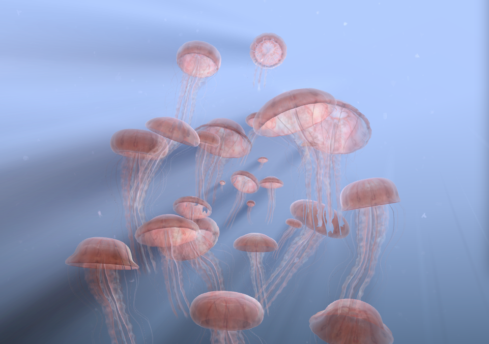
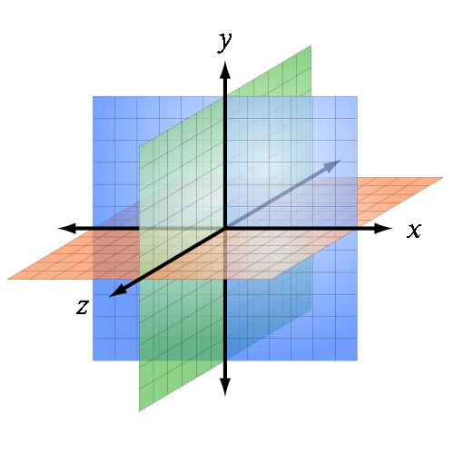
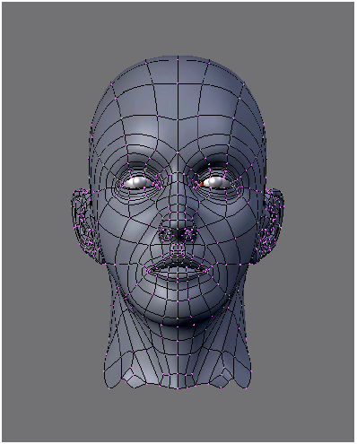

#第一章
##WebGL 概述

水母们一面在水中慢慢的挤着游着，浮浮沉沉，一面还折射层层阳光，莹莹闪闪，美丽到让人震惊，这是一个由电脑实时生成的互动海底水母森林。

移动你的鼠标，你可以逐层浏览人体，皮肤、肌肉、血管、骨骼、神经，你还能通过搜索找到感兴趣的器官，并留下书签以做参考。

哦，这是一个用微博好友和关注者的名字组成的宇宙星系，你可不是点错链接跑进了探索星空频道，也不是在看星战的电影，这些都是可以运行在你的浏览器里的页面，这就是传说中的WebGL。

附图1－1 WebGL实现的模拟水母 ( http://chrysaora.com/ )，转载自Aleksander Rodic

WebGL是一个在互联网上实现三维图像的新标准。通过使用WebGL，程序员可以使用电脑显卡的全部资源和功能，只需要javascript、浏览器和一个标准的技术构架。在WebGL出现之前，开发三维网页必须依赖插件或者应用程序，而且要求用户下载安装特定软件后才能得到三维体验。

WebGL是HTML5标准的一个子集，虽然现在不是官方规则，但是大部分浏览器都已经提供了支持。就象Web Workers、Web Sockets等一样，WebGL是W3C组织的官方建议，同样也是现代浏览器成为一流平台的重要组成部分。

WebGL已经工作在大部分电脑，以及越来越多的移动设备的浏览器上。全球数百万台电脑中已经安装了支持WebGL的环境，也许你家里和公司里的电脑现在就能运行。

WebGL正处在不断成长并且充满活力的系统的核心地位，这个生态系统使得网络体验能获得更加丰富的视觉效果而且更加引人入胜。从游戏开发到数据可视化，从计算机辅助设计到网上零售，现在已经有数以百计的三维网站、程序和工具正在开发之中。

当然在一开始WebGL的API接口底层工作方式会让人望而却步，不过现在已经有好几个开源的JavaScript库可以让我们避免那些枯燥的引用工作。我会注意不过渡宣扬三维开发的难度，有了这些工具大家能循序渐进的了解WebGL的运作机制。总而言之，这也许是你实现心中那个格斗游戏梦想的机会；或许这是你用眩目的三维网页让老板大开眼界的好机会了。

在这章里，我们会简单介绍WebGL的底层调用，而在其他大部分章节我们会使用一个封装了底层的工具：Three.js , 它会帮我们处理很多体力活。当然为了用好它们，我们仍然需要了解这些工具的实现机制，让我们开始探索的WebGL的的核心概念和API接口吧。

###WebGL的定义

WebGL是由科纳斯组织（Khronos Group）开发和管理的，这个组织还管理着OpenGL、COLLADA等一些著名标准。以下是科纳斯组织网站上对WebGL的官方定义：

*WebGL 是免授权费的，跨平台的应用程序接口API，它将OpenGL ES 2.0作为在HTML网页内的3D绘图环境，作为低级别文档对象模型接口开放。它使用OpenGL渲染语言GLSL ES，并可被整洁地与其他3D内容上层或下层的网页内容捆绑。它是使用JavaScript编程开发语言开发适合动态3D网页应用的理想工具，并已被主流互联网浏览器集成。*

这个定义包含了以下几个核心思想：
####WebGL是个API
WebGL完全是通过特定的JavaScript接口访问，而没有新增HTML标签。WebGL的三维渲染使用二维渲染也使用的Canvas元素，它是通过JavaScript API调用。实际上，WebGL的机制就是通过上下文，在Canvas元素上做特定的图像渲染。

####WebGL基于OpenGL ES 2.0
OpenGL ES是从 OpenGL 裁剪定制而来的，ES表示嵌入式系统（embedded systems）。意指其针对多种嵌入式系统专门设计，它已应用与大部分手机和平板。OpenGL ES更是iPhone、iPad、Android等平板的三维力量之源。基于OpenGL ES的低能耗，WebGL的设计者们认为，提供一个一致的、跨平台、跨浏览器的三维API接口是可以实现的。

####WebGL能融入页面
显示WebGL的层可以设置在其他层的上方或者下方。 三维画布可以只是部分的页面，也可以整个页面。它所在的\<div\>标签能通过Z-index排序。这意味着，您可以用WebGL开发三维图形，而页面里其他元素都使用原来的HTML。浏览器会把网页上的图形有机的整合在一起，让用户得到无缝的体验。

####WebGL为动态网页而生
WebGL在设计时就已经考虑到网页交互。虽然起源与OpenGL ES，但它定制了特别的功能，能很好适应网页浏览器和JavaScript，提供友好的网页交互。

####WebGL就是跨平台
WebGL能够运行在任何操作系统上，设备上，从手机和平板电脑台式电脑。

####WebGL完全免费
就象所有开放式网络规范一样，WebGL是免费使用的。没人能跑来问您收取特许权使用费。

Chrome，火狐，Safari和Opera等浏览器的开发商都致力于开发和提供支持WebGL的重要资源，并且这些团队的工程师也是工作组的主要成员，他们参与编写规范。 WebGL的规范流程是开放给所有科纳斯组织成员的，并提供向公众开放的邮件列表。如您需要，请参阅附录A中的邮件列表信息和其他规范资源。

###三维图形--雷管
“数学太难了！”--芭比娃娃。这是句臭名昭著的性别歧视者常说的话，事实上，我和芭比的感觉一样，希望能通过沉迷在购物来治疗在三维开发中受的伤。哪些数学运算实在太难了！幸运的是，你不需要成为数学神童才能理解WebGL；我们有一个库可以替我们干那些麻烦的运算，我们可以省下时间撮火球了！不过在开始用之前，我们还是要了解一下在渲染引擎之下发生的事情，这很重要。以下几页内容是我总结的三维图形基础。

####三维坐标系
三维绘图需要一个三维坐标系统。大家都很熟悉二维坐标系，比如PS里的标尺，比如HTML元素在窗口中的XY值。二维坐标系帮助我们定位\<div\>在页面中的显示位置，或者帮助虚拟的刷子和笔在Canvas元素中绘画。同样的，三维图形需要在三维坐标系里绘制，这里用Z坐标表示深度。

如果你已经熟悉二维坐标系统的概念，我认为过渡到三维坐标系统是非常简单的。不过，下面的内容将变的有点复杂。

####网格、多边形和顶点
尽管有几种方式来绘制三维图形，目前最常用的是使用网格。网格绘制是把一个对象分解成一个或者多个多边形，通过定义多边形的顶点（x,y,z轴）在三维空间中的坐标来确定对象。这些多边形通常是三角形（三个顶点）和四边形（四个顶点）。三维网格通常被称为模型。

图1－3 显示了一个三维网格。由深色线条勾勒出的四边形沟成了网格，组成了脸的形状。（最终效果中，你不会看到这些深色线条，现在它们用作参考）网格顶点的坐标XYZ值只用来定义形状；网格表面的一些性质，如颜色阴影等是通过使用其它属性定义，我们很快就会讨论。

####材质、纹理和灯光
网格表面的定义是使用了XYZ顶点属性之外的新属性。表面属性可以很简单：单一的纯色；也可以很复杂，包含几个信息，例如光线在表面的反射或者物体表面的光泽。表面信息也可以使用一个或多个位图，通常这被称为纹理映射（简称纹理）。纹理可以是简单的文字（就像在T恤衫上印字）或者它们可以和其它纹理组合展现复杂的效果：如不平滑的表面或欧泊的变彩。

图 欧泊的变彩

在大多数图形系统中，网格的结构被统称为材质。材质通常依赖与一个或多个光源，（你可能已经猜到）由光源定义了场景照明。

图1－3中的头部是由紫色的顶点组成网格，光源位置在头像的左侧（注意头像右侧的阴影效果）。

####变换和矩阵

三维网格是由它的顶点坐标定义位置的。每次你想将它移动到视线内的不同位置，特别是在处理网格在屏幕中移动或其它动画时会非常频繁的改变网格顶点的位置。处于节省系统资源的考虑，大多数系统支持调整变形和移动网格的相对值，而不必遍历操作所有顶点的属性就可以明确的改变网格的位置。并且支持网格的缩放、旋转、变形、翻转而无需调整任何顶点的实际值。

变换通常是通过矩阵运算实现，数学对象包含一个数组的值，用来计算变换位置后的顶点坐标。如果你是和作者一样的线性代数爱好者的话，你会感觉这个想法很舒服。如果不是，请不要跟译者一样出上一身冷汗。本书中，我们用的Three.js这个工具将帮助我们把矩阵运算封装成黑盒子：我们刚才说的平移、旋转和缩放它都能准确的完成。

摄像头，透视图，视点和投影

每个渲染场景都需要一个点来确定用户能看到的画面。通常三维系统会为此引入摄像头，摄像头用来表示用户在场景中的位置和方向，以及真是世界中摄像机的属性，例如：

####Shaders

##WebGL的API

####WebGL程序的结构
WebGL是在一天结束的时候，只是一个绘图库的绘图库的类固醇，授出，考虑与WebGL的图形可以绘制煞是威风，今天大多数机器上是充分利用强大的GPU硬件。但它实际上只是另一种帆布，类似于支持所有HTML5浏览器的二维画布。事实上，WebGL的实际使用HTML5<canvas>元素的3D图形浏览器页面。
为了渲染WebGL的页面，应用程序必须，至少，请执行下列步骤：
1。创建一个canvas元素。
2。获取绘图上下文为画布。
3。初始化视口。
4。创建一个或多个缓冲区包含的数据呈现（通常为顶点）。
5。创建一个或多个定义转换矩阵，从顶点缓冲区到屏幕空间。
6。创建一个或多个着色器实现绘图算法。
7。初始化着色器参数。
8。绘制。
本节描述了上述各步骤的一些细节。这里包含的代码剪断的宠物是一个完整的，样本WebGL的画布上绘制一个单一的白色方形的一部分。一个完整的代码清单，请参阅文件第1/example1-1.html章。

####使用Canvas绘图

####视口

####Buffers, ArrayBuffer, and Typed Arrays 缓冲，数组缓冲和类型数组

####矩阵
在绘制 之前，必须创建矩阵的 。

####着色器

####绘制片元

###本章小结

=============================================

Cameras, Perspective, Viewports, and Projections 
Every rendered scene requires a point of view from which the user will be viewing it.

3D systems typically use a camera, an object that defines where (relative to the scene) the user is positioned and oriented, as well as other real-world camera properties such as the size of the field of view, which defines perspective (i.e., objects farther away appearing smaller). The camera’s properties combine to deliver the final rendered image of a 3D scene into a 2D viewport defined by the window or canvas.
Cameras are almost always represented using a couple of matrices. The first matrix defines the position and orientation of the camera, much like the matrix used for trans forms (see the earlier discussion). The second matrix is a specialized one that represents the translation from the 3D coordinates of the camera into the 2D drawing space of the viewport. It is called the projection matrix. I know—sigh—there’s that pesky math again!
But the details of camera matrices are nicely hidden in most toolkits, so you usually can just point, shoot, and render.
Figure 1-4 depicts the core concepts of the camera, viewport, and projection. At the lower left, we see an icon of an eye; this represents the location of the camera. The red vector pointing to the right (in this diagram labeled as the x-axis) represents the direction in which the camera is pointing. The blue cubes are the objects in the 3D scene. The green and red rectangles are, respectively, the near and far clipping planes. These two planes define the boundaries of a subset of the 3D space, known as the view volume or view frustum. Only objects within the view volume are actually rendered to the screen.
The near clipping plane is equivalent to the viewport, where we will see the final rendered image.
Cameras are extremely powerful, as they ultimately define the viewer’s relationship to a 3D scene and provide a sense of realism. They also provide another weapon in the animator’s arsenal: by dynamically moving the camera around, you can create cinematic effects and control the narrative experience.
Shaders